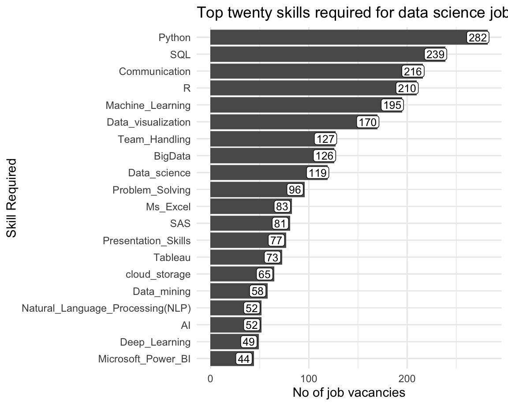
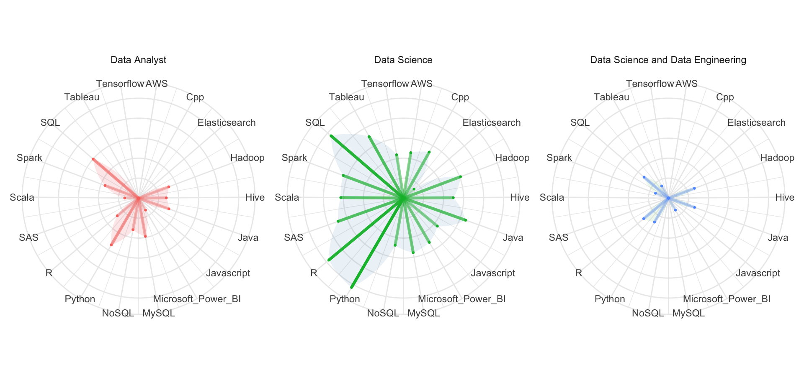

# Locations

Column {data-width=650}
-----------------------------------------------------------------------

### Distribution of Job Advertisements

<div class="knitr-options" data-fig-width="576" data-fig-height="460"></div>
preserve7200c0e6065a9f78

Column {data-width=350}
-----------------------------------------------------------------------

### Composition of job advertisements by contries

<div class="knitr-options" data-fig-width="576" data-fig-height="460"></div>
preserveb2621d9880db9777


# Overview


Row {data-width=350}
-----------------------------------------------------------------------

### **Job Title**

<div class="knitr-options" data-fig-width="576" data-fig-height="460"></div>


### **Company Locations**

<div class="knitr-options" data-fig-width="576" data-fig-height="460"></div>


row {data-width=350}
-----------------------------------------------------------------------

### **Education Qualifications**

<div class="knitr-options" data-fig-width="576" data-fig-height="460"></div>


### **Knowledge Base**

<div class="knitr-options" data-fig-width="576" data-fig-height="460"></div>


# Software - 1


<div class="knitr-options" data-fig-width="576" data-fig-height="460"></div>



# Software - 2

<div class="knitr-options" data-fig-width="960" data-fig-height="460"></div>


# Software - 3


Column {data-width=500}
-----------------------------------------------------------------------

### Top Statistical Software


<div class="knitr-options" data-fig-width="576" data-fig-height="460"></div>
preserve9e34033d5561fb28

Column {data-width=500}
-----------------------------------------------------------------------


<div class="knitr-options" data-fig-width="576" data-fig-height="460"></div>


### Database software and Query languages


<div class="knitr-options" data-fig-width="576" data-fig-height="460"></div>
preserve54a629f72c25753a


# Salary - LKR

Row
-----------------------------------------------------------------------

### Chart A: Salary Distribtion
<div class="knitr-options" data-fig-width="768" data-fig-height="288"></div>
preserve4128821cd2980da9

### Chart B: Violin plot of Experience and Salary

<div class="knitr-options" data-fig-width="576" data-fig-height="460"></div>
preservec02ac910d0836761

Row
-----------------------------------------------------------------------


### Chart C: Violin plot of Salary and Job Category

<div class="knitr-options" data-fig-width="576" data-fig-height="460"></div>
preserve06b5c2c19217465c

### Chart D: Violin plot of Salary and Country

<div class="knitr-options" data-fig-width="576" data-fig-height="460"></div>
preserveb2f6104b44b5db19


# Salary - USD

Row 
-----------------------------------------------------------------------

### Chart A: Salary Distribtion

<div class="knitr-options" data-fig-width="768" data-fig-height="288"></div>
preservec84e7d665f1aa6d5

### Chart B: Violin plot of Experience and Salary

<div class="knitr-options" data-fig-width="576" data-fig-height="460"></div>
preservefb3ecab56c33240b

Row
-----------------------------------------------------------------------


### Chart C: Violin plot of Salary and Job Category

<div class="knitr-options" data-fig-width="576" data-fig-height="460"></div>
preserve142477d1bc5fb92a

### Chart D: Violin plot of Salary and Country

<div class="knitr-options" data-fig-width="576" data-fig-height="460"></div>
preserve4db69c2464a9eea0


# Knowledge and Skills


 
<div class="knitr-options" data-fig-width="576" data-fig-height="460"></div>


Column {data-width=650}
-----------------------------------------------------------------------

### Barchart for Knowledge and Skills

<div class="knitr-options" data-fig-width="576" data-fig-height="460"></div>
preserve340f3a78b0baea4c


Column {data-width=350}{.tabset .tabset-fade}
-----------------------------------------------------------------------

### Knowledge by Job category

<div class="knitr-options" data-fig-width="576" data-fig-height="460"></div>
preserve8865e81e666273d3


### Skills by Job Category

<div class="knitr-options" data-fig-width="576" data-fig-height="460"></div>
preservef058d6f3f8b23263


# Experience


<div class="knitr-options" data-fig-width="576" data-fig-height="460"></div>


<div class="knitr-options" data-fig-width="576" data-fig-height="460"></div>


Column {data-width=700}
-----------------------------------------------------------------------
### Number of jobs by Experience Catergories

<div class="knitr-options" data-fig-width="576" data-fig-height="460"></div>
preservef4e030af76b57797


Column {data-width=300}{.tabset .tabset-fade}
-----------------------------------------------------------------------


### Distribution of Minimum Experience by Education Catergory

<div class="knitr-options" data-fig-width="576" data-fig-height="460"></div>
preservebf912f00020cf97a

<div class="knitr-options" data-fig-width="576" data-fig-height="460"></div>


```
# A tibble: 6 x 2
  Edu_Category no_row
  <fct>         <int>
1 Other            25
2 Some Degree      90
3 Min_Bsc         147
4 Min_Master       58
5 Phd              17
6 <NA>             93
```


<div class="knitr-options" data-fig-width="576" data-fig-height="460"></div>


```
# A tibble: 147 x 115
      ID Consultant DateRetrieved DatePublished Job_title Company R     SAS  
   <int> <chr>      <date>        <date>        <chr>     <chr>   <fct> <fct>
 1     5 Jayani     2020-08-07    2020-07-24    DA-Data … E.D. B… 0     1    
 2    10 Jayani     2020-08-12    2020-08-11    Associat… Phrees… 1     0    
 3    12 Jayani     2020-08-13    2020-08-13    Data Ana… EPCOR … 0     0    
 4    15 Jayani     2020-08-13    2020-08-13    Lead Dig… Nation… 0     0    
 5    19 Jayani     2020-08-13    2020-08-13    Data Ana… Univer… 0     1    
 6    23 Jayani     2020-08-13    2020-08-13    Data Sci… Teleno… 1     0    
 7    27 Jayani     2020-08-13    2020-08-13    Smart Ma… Micron… 0     0    
 8    39 Jayani     2020-08-13    2020-08-13    Assistan… UNILEV… 1     1    
 9    55 Thimani    2020-08-07    2020-07-22    Data Sci… Amazon  1     1    
10    56 Thimani    2020-08-07    2020-07-31    Data Sci… Brilli… 1     1    
# … with 137 more rows, and 107 more variables: SPSS <fct>, Python <fct>,
#   MAtlab <fct>, Scala <fct>, C_Sharp <fct>, MS_Word <fct>, Ms_Excel <fct>,
#   OLE_DB <fct>, Ms_Access <fct>, Ms_PowerPoint <fct>, Spreadsheets <fct>,
#   Data_visualization <fct>, Presentation_Skills <fct>, Communication <fct>,
#   BigData <fct>, Data_warehouse <fct>, cloud_storage <fct>,
#   Google_Cloud <fct>, AWS <fct>, Machine_Learning <fct>, Deep_Learning <fct>,
#   Computer_vision <fct>, Java <fct>, Cpp <fct>, C <fct>, Linux_Unix <fct>,
#   SQL <fct>, NoSQL <fct>, RDBMS <fct>, Oracle <fct>, MySQL <fct>, PHP <fct>,
#   Flash_Actionscript <fct>, SPL <fct>,
#   web_design_and_development_tools <fct>, Wordpress <fct>, AI <fct>,
#   `Natural_Language_Processing(NLP)` <fct>, Microsoft_Power_BI <fct>,
#   Google_Analytics <fct>, graphics_and_design_skills <fct>,
#   Data_marketing <fct>, SEO <fct>, Content_Management <fct>, Tableau <fct>,
#   D3 <fct>, Alteryx <fct>, KNIME <fct>, Spotfire <fct>, Spark <fct>,
#   S3 <fct>, Redshift <fct>, DigitalOcean <fct>, Javascript <fct>,
#   Kafka <fct>, Storm <fct>, Bash <fct>, Hadoop <fct>, Data_Pipelines <fct>,
#   MPP_Platforms <fct>, Qlik <fct>, Pig <fct>, Hive <fct>, Tensorflow <fct>,
#   Map_Reduce <fct>, Impala <fct>, Solr <fct>, Teradata <fct>, MongoDB <fct>,
#   Elasticsearch <fct>, YOLO <fct>, agile_execution <fct>,
#   Data_management <fct>, pyspark <fct>, Data_mining <fct>,
#   Data_science <fct>, Web_Analytic_tools <fct>, IOT <fct>,
#   Numerical_Analysis <fct>, Economic <fct>, Finance_Knowledge <fct>,
#   Investment_Knowledge <fct>, Problem_Solving <fct>, Korean_language <fct>,
#   Bash_Linux_Scripting <fct>, Team_Handling <fct>,
#   Debtor_reconcilation <fct>, Payroll_management <fct>, Bayesian <fct>,
#   Optimization <fct>, Bahasa_Malaysia <fct>, Knowledge_in <chr>, City <chr>,
#   Location <chr>, Educational_qualifications <chr>, Salary <chr>,
#   English_proficiency <chr>, URL <chr>, Search_Term <chr>,
#   Job_Category <fct>, …
```


```
# A tibble: 4 x 2
  Experience_Category                no_row
  <fct>                               <int>
1 Unknown or Not needed                  28
2 Two or less years                      56
3 More than 2 and less than 5 years      49
4 More than 5 and less than 10 years     14
```


<div class="knitr-options" data-fig-width="576" data-fig-height="460"></div>


```
# A tibble: 4 x 2
  Experience_Category                no_row
  <fct>                               <int>
1 Unknown or Not needed                  12
2 Two or less years                      24
3 More than 2 and less than 5 years      14
4 More than 5 and less than 10 years      8
```


<div class="knitr-options" data-fig-width="576" data-fig-height="460"></div>


```
# A tibble: 5 x 2
  Experience_Category                no_row
  <fct>                               <int>
1 Unknown or Not needed                   7
2 Two or less years                      11
3 More than 2 and less than 5 years       5
4 More than 5 and less than 10 years      1
5 More than 10 years                      1
```


<div class="knitr-options" data-fig-width="576" data-fig-height="460"></div>


```
# A tibble: 4 x 2
  Experience_Category                no_row
  <fct>                               <int>
1 Unknown or Not needed                   3
2 Two or less years                       4
3 More than 2 and less than 5 years       7
4 More than 5 and less than 10 years      3
```


<div class="knitr-options" data-fig-width="576" data-fig-height="460"></div>


```
# A tibble: 4 x 2
  Experience_Category                no_row
  <fct>                               <int>
1 Unknown or Not needed                  22
2 Two or less years                      37
3 More than 2 and less than 5 years      24
4 More than 5 and less than 10 years      7
```


### Education

<div class="knitr-options" data-fig-width="576" data-fig-height="460"></div>
preserve5b66a150530456ee

<div class="knitr-options" data-fig-width="576" data-fig-height="460"></div>


```
# A tibble: 4 x 2
  Job_Category                      no_row
  <fct>                              <int>
1 Data Analyst                          23
2 Data Science                         210
3 Data Science and Data Engineering      8
4 Unimportant                          189
```


<div class="knitr-options" data-fig-width="576" data-fig-height="460"></div>


```
# A tibble: 4 x 2
  Experience_Category                no_row
  <fct>                               <int>
1 Unknown or Not needed                   2
2 Two or less years                      10
3 More than 2 and less than 5 years       7
4 More than 5 and less than 10 years      4
```


<div class="knitr-options" data-fig-width="576" data-fig-height="460"></div>


```
# A tibble: 5 x 2
  Experience_Category                no_row
  <fct>                               <int>
1 Unknown or Not needed                  59
2 Two or less years                      63
3 More than 2 and less than 5 years      64
4 More than 5 and less than 10 years     23
5 More than 10 years                      1
```


<div class="knitr-options" data-fig-width="576" data-fig-height="460"></div>


```
# A tibble: 0 x 2
# … with 2 variables: Experience_Category <fct>, no_row <int>
```


<div class="knitr-options" data-fig-width="576" data-fig-height="460"></div>


```
# A tibble: 2 x 2
  Experience_Category               no_row
  <fct>                              <int>
1 Two or less years                      5
2 More than 2 and less than 5 years      3
```


### Job Category

<div class="knitr-options" data-fig-width="576" data-fig-height="460"></div>
preservefe8452e7c3aa3779


# English Profeciency

Column {data-width=650}
-----------------------------------------------------------------------
<div class="knitr-options" data-fig-width="576" data-fig-height="460"></div>

<div class="knitr-options" data-fig-width="576" data-fig-height="460"></div>

### Chart A

<div class="knitr-options" data-fig-width="576" data-fig-height="460"></div>
preserve5153f5efeb55652b


# About

## Data

```r
#install.packages("devtools")
devtools::install_github("thiyangt/DSjobtracker")
library(DSjobtracker)

```


## Our Team

Location: Shashini Silva

Overview: Malshan Fernando

Salary - LKR: Chammika De Mel

Salary - USD: Chammika De Mel

English Proficiency - Piumika

Knowledge and Skills - N N Madushani

Experience - P V S N Madushani

Software/ Software skills needed for each job category - Janith Wanniarachchie

Statistical software/ Database software/ Query languages - Jayani Lakshika Piyadigamage


Project coordinator: Dr Thiyanga S Talagala
