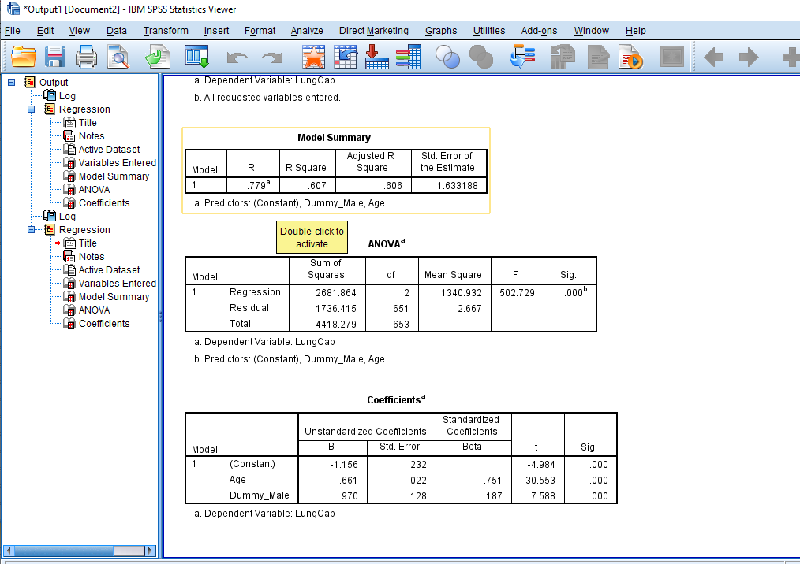
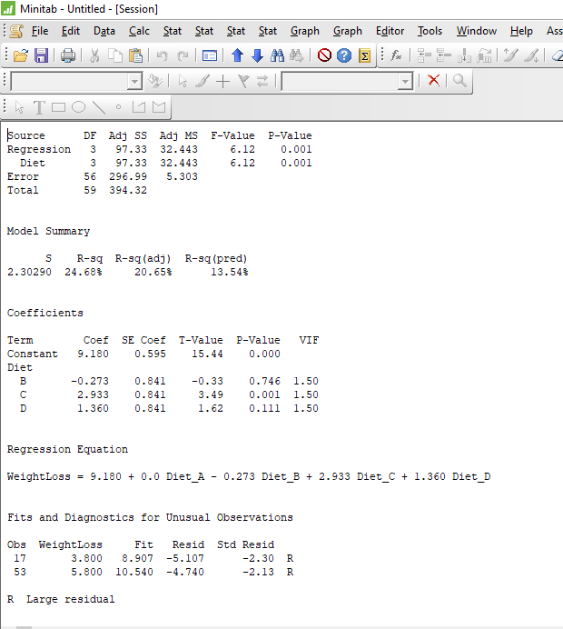

```{r setup, include=FALSE}
knitr::opts_chunk$set(echo = TRUE)
```

```{r, include=FALSE}
library(here)
library(xtable)
```

```{r, include=FALSE}
here::here()
```

##Dummy variable in regression

In **regression**, a **dummy variable** is a numerical variable that is used to represent subgroups of the sample in the study. Dummy variables are also known as **indicator variables, design variables, contrasts, one-hot coding, and binary basis variables.** A dummy variable is used to include **categorical or qualitative variable or factors** in a regression model. 

If the categorical variable has N levels, then there is (N-1) dummy variables to represent the categorical variable. Remaining one is used as a reference level or baseline.

##Reference level or baseline

The **level** of the categorical variable to which all of the other levels are compared is known as the **reference level**.  All the interpretations are defined by comparing with the reference level or baseline.

##Coding system for categorical variables in regression analysis

###Example 1:

X is a dummy variable which represents the gender of an individual.

X = 0, if male

X = 1, if female

###Example 2:

E is the categorical variable which represents the education levels of an individual. E has three levels as follows:

* Undergraduate

* Graduate

* Postgraduate

Since variable E has three levels, there are 2 dummy variables to represent E.


```{r echo=FALSE, results='asis', warning=FALSE}
library(knitr)
b <- c('Undergraduate','Graduate','Postgraduate')
c <- c('1',' 0','0')
d <- c('0','1','0')

df <- data.frame(b,c,d)
names(df) <- c('E','Dummy_1' , 'Dummy_2')
kable(df)
```


The order of the levels of categorical variables and the reference level can be changed when creating dummies. In this example, the reference level is “Postgraduate”.


##Advantage of using a dummy variable

* Unless writing separate equation models for each subgroup, dummy variables enables us to use a single regression equation to represent multiple groups.
 
* Even though coded dummy variable is a nominal-level variable, can be treated as an interval-level variable statistically.

##Interaction effect

The **effect** of one variable depends on the value of another variable is defined as the **interaction effect.**

##Effect

The **difference** between the true population parameter and the null hypothesis value is called as an **effect**. Effect is also known as population effect or the difference.

Eg:- The mean difference between the weight loss for male and female is the effect.

The **true population parameter** is not known. Samples are taken from the population and by using a statistical test, such as a t-test or a one-way ANOVA, determines whether an effect exists. 

##Regression with a dummy variable in R

###Specificity in R
**R** will create the dummy variable ***automatically.***

By default, in R the **first level** of the categorical variable appears alphabetically or numerically(if the categorical variable is coded as 0,1,2,...) is defined as the baseline or reference level.

###Multiple Linear regression with dummy variables

```{r}
DietWeigthLoss <- read.delim("DietWeigthLoss.csv")
head(DietWeigthLoss,5)
```

```{r, include=FALSE}
typeof(DietWeigthLoss$Diet)
typeof(DietWeigthLoss$WeightLoss)
```

```{r, include=FALSE}
DietWeigthLoss$Diet_factor <- as.factor(DietWeigthLoss$Diet)
```

```{r}
levels(DietWeigthLoss$Diet_factor)
```

Since there are four levels in the Diet category variable, three dummy variables are needed to represent the Diet category variable.

According to this example, the baseline or reference level is Diet category A.

An individual in:
```{r echo=FALSE, results='asis', warning=FALSE}
b <- c('A','B','C','D')
c <- c('0',' 1','0','0')
d <- c('0','0','1','0')
e <- c('0','0','0','1')

df <- data.frame(b,c,d,e)
names(df) <- c('Diet','Dummy_A','Dummy_B','Dummy_C')
kable(df)
```


###Model equation

\begin{aligned}
\hat{Y} = \beta_0+ \beta_1 X_B+ \beta_2 X_C + \beta_3 X_D\\
\end{aligned}

```{r}
model1 <- lm(WeightLoss ~ Diet_factor,DietWeigthLoss)
summary(model1)
```

###Hypothesis to be tested

\begin{aligned}
H_0:\text{The coefficient is not significant.}\\
H_1:\text{The coefficient is significant.}
\end{aligned}

####Decision rule
Reject $H_0$ if p-value$\leq 0.05$

####Conclusion

We have enough evidence to say that Diet_factorC is significant at 5% level of significance.

###Interpretations

$\beta_0$ = 9.18

Mean WeightLoss for someone in the reference group, A is 9.18.

$\beta_2$ = 2.933

The increase in mean WeightLoss for category C relative to category A is 2.933.

###Change Reference(Baseline) category

If we want to change the reference level or beseline in R, we can use the following codes and fit the model.

```{r}
DietWeigthLoss$Diet_factor_new <- relevel(DietWeigthLoss$Diet_factor, ref = "C")
```

```{r}
model2 <- lm(WeightLoss ~ Diet_factor_new,DietWeigthLoss)
summary(model2)
```

##Multiple Linear regression with a dummy variable

```{r}
LungCapData <- read.csv("LungCapData2.csv")
head(LungCapData,5)
```


```{r, include=FALSE}
typeof(LungCapData$Gender)
typeof(LungCapData$Smoke)
```

```{r, include=FALSE}
LungCapData$Gender_factor <- as.factor(LungCapData$Gender)
LungCapData$Smoke_factor <- as.factor(LungCapData$Smoke)
```

```{r}
levels(LungCapData$Gender_factor)
levels(LungCapData$Smoke_factor)
```

Since Gender has two categories, only one dummy is needed. According to this example, the baseline or reference level is Gender category female.

```{r echo=FALSE, results='asis', warning=FALSE}
b <- c('Female','Male')
c <- c('0','0')
d <- c('0','1')

df <- data.frame(b,c,d)
names(df) <- c('Gender','Dummy_Female','Dummy_Male')
kable(df)
```

###Model equation

\begin{aligned}
\hat{Y} = \beta_0+ \beta_1 \text{Age}+ \beta_2 \text{Gender_factor_Male} \\
\end{aligned}

```{r}
model3 <- lm(LungCap ~ Age + Gender_factor,LungCapData)
summary(model3)
```

##Multiple Linear regression with an interaction

###Model equation

\begin{aligned}
\hat{Y} = \beta_0+ \beta_1 \text{Age}+ \beta_2 \text{Gender_factor_Male} + \beta_3 \text{Age *Gender_factor_Male} \\
\end{aligned}

```{r}
model4 <- lm(LungCap ~ Age + Gender_factor + Age*Gender_factor ,LungCapData)
summary(model4)
```

###Hypothesis to be tested

\begin{aligned}
H_0:\text{The interaction effect is not significant.}\\
H_1:\text{The interaction effect is significant.}
\end{aligned}

####Decision rule
Reject $H_0$ if p-value$\leq 0.05$

####Conclusion
The interaction effect is significant at 5% level of significance.

###Interpretations

$\beta_0$ = 0.5484

Mean LungCap for someone in the reference group, female is 0.5484.

$\beta_1$ = 0.48819

For female, the increase in mean LungCap is 0.48819 for unit increase in Age .

$\beta_2$ = -2.32760

The decrease in mean LungCap for category Male relative to category Female is 2.32760.

$\beta_3$ = 0.33225

The increase in mean LungCap for category Male relative to category Female is 0.33225 in unit increase in Age.

##Regression with a dummy variable in SPSS
###Disadvantage in SPSS:
SPSS will **not** create the dummy variable automatically. We have to define dummies before fitting the model.

SPSS is used *Recode into Different Variables* to create dummy variables. 

{height=50% width=50%}


By using *Linear Regression* in SPSS, we can fit the simple & multiple regression models.

{height=50% width=50%}

###Multiple Linear regression with dummy variables

{height=50% width=50%}


###Multiple Linear regression with a dummy variable
{height=50% width=50%}

###Multiple Linear regression with an interaction

We have to create new variable to define interaction. In theis example, we create new variable by multiplying Age and Gender_factor_Male in each individuals.

{height=50% width=50%}


##Regression with a dummy variable in Python
###Specificity in Python:
Python will create the dummy variable ***automatically.***
By default, in Python the first level of the categorical variable appears alphabetically or numerically(if the categorical variable is coded as 0,1,2,...) is defined as the baseline or reference level.

###Multiple Linear regression with dummy variables

{height=50% width=50%}

###Example:
{height=50% width=50%}


###Multiple Linear regression with a dummy variable
{height=50% width=50%}

###Example:

{height=50% width=50%}

###Multiple Linear regression with an interaction
{height=50% width=50%}


##Regression with a dummy variable in Minitab

###Specificity in Minitab:
Minitab will create the dummy variable ***automatically.***
By default, in Minitab the first level of the categorical variable appears alphabetically or numerically(if the categorical variable is coded as 0,1,2,...) is defined as the baseline or reference level.

###Simple Linear regression with a dummy variable

{height=50% width=50%}

###Multiple Linear regression with dummy variables
{height=50% width=50%}

###Multiple Linear regression with a dummy variable

{height=50% width=50%}

###Multiple Linear regression with an interaction
{height=50% width=50%}


###Interaction plot

On an *interaction plot*, parallel lines indicate that there is no **interaction effect** while different slopes suggest that one might be present. Below is the plot for Age*Gender_factor_Male.

{height=50% width=50%}


The crossed lines on the graph suggest that there is an interaction effect, which the significant p-value for the Age*Gender_factor_Male term confirms. 

By comparing the R,SPSS, Python, and Minitab outputs you can see that;

* R output values are rounded to five decimal places
* SPSS & Minitab output valuess are rounded to three decimal places
* Python output values are rounded to four decimal places

For more details, you can refer the **What is p-value?, ANOVA, and Multiple linear regression** blogs. 

##References

---
nocite: | 
  @rf1, @rf2, @rf3, @rf4, @rf5
...

